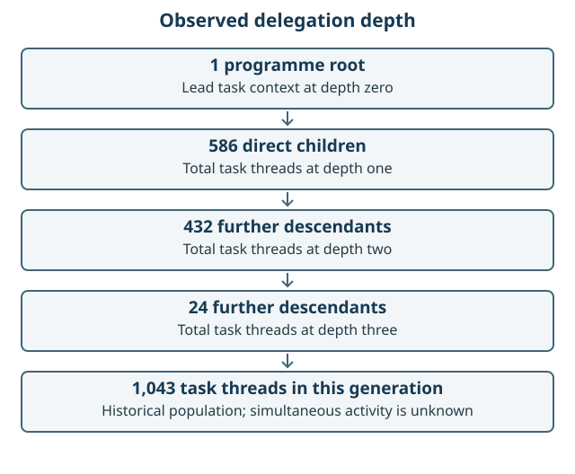

# The delegated agent record

This chapter describes the agent task tree preserved for the GIS AI GO work. It
answers a narrower question than “how many agents worked at once?”: **how many
distinct task threads appear in the authenticated preservation snapshot, how were
they related, and what outcome evidence survives?**

The snapshot closed at `2026-09-14T06:31:07.954Z`. It contains 1,043 distinct task
threads: one programme root and 1,042 parented threads. The public
[JSON census](data/agent-census.json) and [CSV census](data/agent-census.csv) give
every thread a publication-only pseudonym and retain its parent, depth and bounded
activity flags. They do not publish conversation or account identifiers.

## What the number means

| Measure | Preserved count | Safe interpretation |
| --- | ---: | --- |
| Distinct task threads | 1,043 | Deduplicated identities in one authenticated closure snapshot |
| Programme roots | 1 | The root from which the retained parent tree descends |
| Direct children of the root | 586 | Depth 1 in the parent graph |
| Grandchildren | 432 | Depth 2 in the parent graph |
| Great-grandchildren | 24 | Depth 3, the maximum preserved depth |
| Threads with nickname metadata | 597 | A metadata-presence count, not a role or concurrency count |
| Captured projections | 1,041 | Threads whose safe user-visible projection was retained |
| Excluded projections | 2 | Threads rejected by the preservation safety boundary |

The earlier on-screen impression of “about 600 agents” is consistent with the 597
threads for which richer agent nickname and communication metadata survives. It
was not a reliable total. Conversely, 1,043 does **not** mean 1,043 simultaneous
workers. A task thread can represent a short delegated check, a resumed turn or a
later preservation task, and the host controls actual concurrency.

## What can be reconstructed



## How the lead model creates an agent

The person does not need to write every agent definition. The lead model selects
a bounded subtask, writes its assignment and asks the host's delegation tool to
create a child context. That context receives instructions, a model, permitted
tools and selected history. It returns messages and a result; the lead decides
what to integrate. Children can delegate further where the host permits it.
This is creation of a task-running context, not training a new model or creating
an unrestricted independent identity. The host still limits tools and concurrency.

For example, this review can be explained with the following **illustrative
assignment**, not a recovered historical prompt:

```text
Review the gateway and provider implementation at the fixed baseline.
Read source and existing tests; do not change runtime behaviour.
Write findings, evidence, review coverage and remaining limitations.
Own only the runtime review and allocated README corrections.
Stop when the report is complete; return findings for lead integration.
```

The resulting [runtime review](reviews/RUNTIME_REVIEW.md) is a delivered artefact.
Its existence is stronger than a task-complete marker, but its assertions still
need source inspection and independent challenge. The full original assignment
wording and model identity cannot be reconstructed for every historical row.

## What the retained markers establish

The authenticated generation manifest preserves one parent reference for every
non-root task. This establishes a three-level delegation tree below the programme
root. It also preserves bounded event markers:

| Terminal evidence class | Threads | What it establishes |
| --- | ---: | --- |
| Task-complete marker observed | 988 | At least one turn emitted a completion marker |
| Completed turn with an error marker | 5 | A turn ended but reported an error |
| Turn aborted without completion | 12 | An abort marker survives and no completion marker does |
| No terminal evidence | 38 | The projection does not establish an ending |

These classes are deliberately mechanical. A completion marker does not prove the
work was useful, correct, integrated or accepted. The census therefore records
`usefulness_or_acceptance` as `unknown` for every row. Repository commits, reviews,
checks and accepted evidence projections—not an agent’s own completion message—are
the stronger evidence for delivered outcomes.

The preserved metadata also establishes that agent-to-agent delegation occurred.
It does not retain the full assignment text: `NEW_TASK` and `MESSAGE` payloads were
excluded by the preservation projection, and only 37 threads retain a final-answer
payload. The 597 private nicknames are treated only as evidence that metadata was
present. They are not published or used to infer a role. Actual per-thread model
identity is likewise unavailable; a provider label is not proof of the model that
ran a particular task.

## The important gap

The programme-root projection was rejected by the safety filter. Every retained
generation checked for this retrospective—both the predecessor and successor
preservation series—has the same root exclusion. The separate repair-task root is
not a substitute for the original delivery conversation. As a result, the public
record can prove the task topology and many user-visible subagent events, but it
cannot reproduce the complete root conversation or all original assignment
wording.

This is a genuine missing source, not a zero. Issue
[#86](https://github.com/chris-page-gov/gis-ai-go/issues/86) must not be closed on a
claim that every agent assignment or every Claude attempt has been fully
reconstructed unless another authorised source fills the gap.

## Public and private forms

The owner-only retrospective keeps the source crosswalk, preserved identifiers,
available assignment labels, messages, digests and source locations. The public
census publishes only:

- stable pseudonyms and pseudonymous parent links;
- depth and child count;
- metadata-presence flags;
- bounded turn and terminal markers; and
- explicit `unknown` judgements where evidence cannot establish quality or
  acceptance.

This split permits aggregate scrutiny without turning private conversations,
machine details or authentication context into repository content. See
[the evidence method](EVIDENCE_METHOD.md) for the redaction and interpretation
rules.

## What the exemplar teaches

The agent tree shows useful division of labour at unusual scale, but scale itself
is not the achievement. The defensible pattern is:

1. a person sets purpose, authority and publication boundaries;
2. delegated agents work on bounded assignments;
3. contracts, tests and independent review challenge their outputs;
4. protected repository history records accepted changes; and
5. a privacy-preserving evidence system retains enough lineage to audit the
   process later.

The main improvement is to preserve a safe assignment summary, model/runtime
attestation and accepted-outcome link at task completion, rather than attempting to
infer them afterwards. Concurrency, elapsed time, token use, provider cost and
accepted value should remain separate measures.
