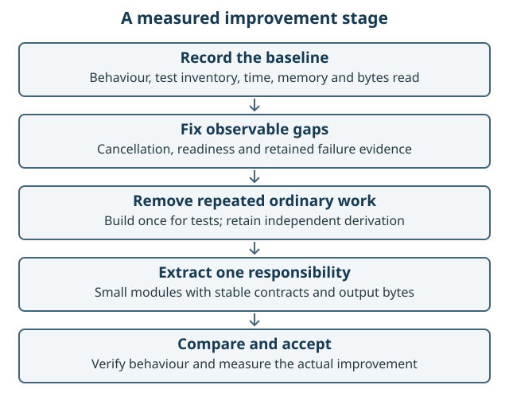

# Separate modularisation and optimisation stage

Work item: [IMPROVE-215 #119](https://github.com/chris-page-gov/gis-ai-go/issues/119).

Status: proposed implementation stage following the review. This plan does not
change runtime behaviour, CI routing, release versions or preservation semantics.
The owner requested it as a separate stage so the chronicle can compare the code
before and after improvement.

Figure 8. Establish a baseline, fix concrete defects, remove redundant ordinary
work, extract modules and compare observed results. Retain a rollback point at
each accepted change.

## Sequence

The Claude retrospective adds two separately scoped P1 prerequisites for a future
client investigation: [pinned client-contract preflight #122](https://github.com/chris-page-gov/gis-ai-go/issues/122)
and [an attempt/outcome journal #123](https://github.com/chris-page-gov/gis-ai-go/issues/123).
They are backlog items, not functionality implemented by this report. The existing
CI-selection work in #97 and archive-throughput work in #116 retain their own
acceptance gates. Evaluate fewer avoidable attempts and repeated checks on
comparable workloads; do not claim savings from these proposals alone.

| Stage | Work | Acceptance evidence |
| --- | --- | --- |
| O0: dependency-alert disposition | Assess all three recorded Hono advisories and update the locked dependency where required | Per-advisory evidence; compatible SDK/HTTP tests, SBOM and image assurance; no silent waiver |
| O1: measure and retain diagnostics | Record build/replay counts; retain both browser failure directories | Same test inventory; failure artefacts available; measured baseline |
| O2: local reliability | Cache freshness/readiness, delayed lease deadline, cancellation capacity where applicable | Boundary-time and saturation regressions; unchanged allowed profile |
| O3: ordinary build orchestration | Compile the shared dependency graph once for a check run | Same tests and outputs; fewer ordinary compiler invocations |
| O4: readiness verification | Combine duplicated checks within one assessment | Fewer replay calls; same corruption and capacity failures |
| O5: assurance decomposition | Extract canonical I/O, archive admission, projection, acquisition and verification modules | Old/new synthetic outputs match; hostile cases still fail |
| O6: runtime decomposition | Extract query stages and evidence/checkpoint responsibilities | Stable exports, schemas, digest domains and recovery ordering |
| O7: trusted CI selection | Complete #97's base/candidate agreement and shadow evaluation | No missed affected lane; unknown or changed policy runs full |
| O8: preservation optimisation | Implement #116 from a measured store baseline | Complete verification, unchanged source coverage, measured bytes/time/memory |
| O9: measured UI scaling | Optimise immutable indexes/rendering only if benchmarks justify it | Preserved keyboard/history behaviour and measured response improvement |

## Scope each change

One change owns one responsibility and a small set of files. Keep CLI entrypoints,
public APIs and existing immutable evidence formats stable. Add an adapter during
module extraction where that preserves callers. Do not combine behavioural repair,
format migration and performance optimisation in a single opaque patch.

For query code, keep the order explicit: validate, decide policy, reserve provider
capacity, acquire immutable ownership, execute, validate result, publish evidence
and update reconciliation. For storage, separate low-level canonical encoding from
the verifier's independent acceptance of a producer claim. Reusing a serializer is
different from using the producer as its own acceptance oracle.

## Measurements

Use the same source inputs, toolchain and workload before and after. Record
hardware and concurrency. Measure build invocations, test inventory, wall time,
peak memory, bytes read and event-loop delay where applicable. Use deterministic
operation counts as well as noisy timing. Establish p50/p95 targets only after a
baseline exists; do not invent percentages to make the plan sound precise.

Compare cold install, cold start, warm start, first query and repeated readiness
separately. Preserve zero-, small- and near-capacity workload cases. A faster result
that silently omits evidence or skips affected tests fails acceptance.

## Safe completion and rollback

Each stage requires focused regressions, independent review, mandatory canonical CI
and a recorded exact commit. During shadow evaluation all current CI checks remain.
Retain public, provider-free fixtures and old accepted artefact bytes where a
behaviour-preserving change promises identity. Revert the scoped change if its
contract or improvement claim fails; do not alter historical receipts to fit it.

The [local-completion plan](LOCAL_COMPLETION_PLAN.md) determines which reliability
items are prerequisites for the local edition. Broader modularisation may follow
that usable milestone. Neither the retrospective nor this plan closes public
hosting, live-provider or deployment acceptance.

## Add the result to the chronicle

For every implemented stage add a before/after record: finding, source revision,
model/guidance setting, change, tests, measured effect, review findings and remaining
limits. Keep failed optimisation experiments too. This is how the case study can
show learning over time and assess whether a model transition improved outcomes.
