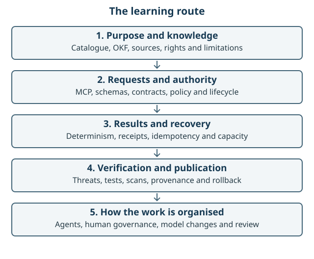
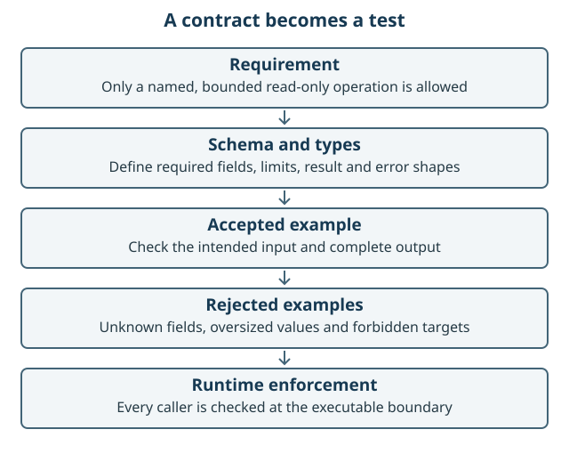
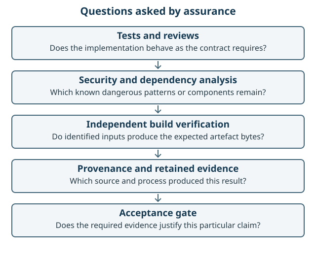

# Learning path: from a question to governed software

This path assumes no previous MCP implementation experience. Read the explanation,
open the linked code, try the small exercise and check the expected observation.
Experienced implementers can use the exercises as a review checklist. The optional
local commands use the pinned prerequisites in the repository README and make no
live provider call.

Figure 4. Begin with purpose and data, follow a single request, examine its evidence,
then study delivery and review. Each stage adds one kind of assurance.

## 1. A catalogue before a chatbot

**Learn:** metadata describes a resource: its identity, provider, rights, dates,
capabilities and limitations. OKF packages that knowledge so it can be consumed by
people and software. JSON-LD adds explicit semantic relationships; it does not
make an unsupported assertion true.

**Read:** [the OKF inputs](../../okf/README.md),
[catalogue build](../../scripts/build_okf.py) and
[public Explorer](../../apps/public-explorer/README.md).

**Try:** browse the supported Explorer, open a record and identify its source,
rights and vintage. Follow a referenced source.

**Check:** you can explain the difference between discovering a dataset and being
entitled or technically able to query it. A catalogue item is not a live data result.

## 2. Contracts make promises precise

Figure 5. A requirement becomes a bounded schema, an accepted example, rejected
variants and runtime enforcement. These complement development-time types.

**Learn:** a contract specifies accepted input, expected output and errors. JSON
Schema gives machine-readable constraints; TypeScript types catch development-time
mistakes. Runtime validation is still needed because callers and files can contain
values the type system never saw. A closed schema rejects unexpected fields.

**Read:** [shared contracts](../../packages/contracts/README.md),
[schemas](../../schemas/) and
[contract validation](../../scripts/validate_contracts.py).

**Try:** inspect a request schema and find a required property, an enum or bound,
and the rule for extra properties. Then find the test for an invalid value.

**Check:** a passing type check and a passing schema test answer different questions.
Neither establishes that the result is useful to a person.

## 3. MCP connects a client to operations

**Learn:** MCP lets a host discover tools and resources and call named operations
with structured arguments. A tool performs an operation; a resource exposes
addressable context. STDIO carries messages through local process pipes; Streamable
HTTP carries them over HTTP. A client version may support a different protocol
version from the server. Tool discovery is a weaker claim than successful use.

**Read:** [the interoperability guide](../../tests/interoperability/README.md),
[MCP server](../../apps/mcp-gateway/src/mcp-server.ts) and
[HTTP transport](../../apps/mcp-gateway/src/mcp-http.ts).

**Try:** follow the [local quick start](../operations/LOCAL-212_CLEAN_CLONE_LOCAL_CANDIDATE.md)
and run `pnpm run test:local-candidate` from the repository root after installing
the locked dependencies.

**Check:** the acceptance journey discovers five tools and three resources and
calls each tool. It reports approved-cache provenance and no provider egress.
Do not count the twelve profile definitions as twelve callable tools.

## 4. Separate intent from deterministic calculation

**Learn:** a language model can interpret a question and propose structured calls.
The service validates those arguments and performs the calculation deterministically.
The same validated input should produce the same defined output under the same
source/version conditions. This reduces ambiguity in testing and replay.

**Read:** [selection resolution](../../apps/mcp-gateway/src/selection-application.ts),
[Python geometry](../../services/geo-execution/src/gis_ai_go_execution/geometry.py)
and [WebMCP catalogue tools](../../apps/webmcp-explorer/src/catalogue-tools.ts).

**Try:** compare a manual catalogue search with its tool-call equivalent. Inspect
where unknown fields and excessive query terms are rejected.

**Check:** the model does not receive authority to execute arbitrary SQL, URLs,
Python or a new provider operation merely because it can describe one.

## 5. Policy and lifecycle govern what can run

**Learn:** an authority context describes the permission basis constructed by the
server. A policy decision evaluates a particular allowed operation and resource.
An obligation describes something required of an allowed result, such as evidence
or attribution. Lifecycle states distinguish planned, suspended and admitted
capabilities. Deny by default means uncertainty cannot silently grant permission.

**Read:** [authority context](../../packages/authority-context/README.md),
[policy evaluator](../../packages/policy-client/README.md),
[tool registry](../../packages/tool-registry/README.md) and
[governed assembly](../../apps/mcp-gateway/src/governed-assembly.ts).

**Try:** trace one tool from profile to discovery filtering to call-time checking.
Find an operation that remains planned.

**Check:** discovery and invocation agree about suspension. The current compiled
anonymous-open policy is not an external OPA service or enterprise authorisation.

## 6. Evidence is more than a log message

**Learn:** canonical JSON gives semantically equivalent data one defined byte form.
A cryptographic digest identifies those bytes. A receipt binds the operation's
parameters, policy and result evidence. A ledger persists accepted records. A
signature or build attestation adds a claim about an issuer; a digest alone does
not establish identity or truth.

**Read:** [canonical JSON](../../packages/evidence/src/canonical-json.ts),
[receipt package](../../packages/evidence/README.md) and
[durable ledger](../../packages/evidence/src/public-ledger.ts).

**Try:** follow a `catalogue.search` receipt into `evidence.inspect`. Identify the
stored earlier receipt and the separate receipt for the current inspection.

**Check:** you can distinguish integrity, persistence, provenance and attestation.
The local candidate's receipts do not establish production durability.

## 7. Failure recovery needs its own contract

**Learn:** a timeout can mean the caller did not receive a response even though
work occurred. Idempotency identifies repeated requests so retrying does not
silently repeat an effect. GIS AI GO's receipt-only reconciliation recovers evidence
of the earlier query rather than rerunning it or reproducing its original result.
A capacity limit bounds stored claims; health and readiness serve different purposes.

**Read:** [reconciliation index](../../packages/evidence/src/reconciliation-index.ts),
[data query](../../apps/mcp-gateway/src/data-query-application.ts) and
[ADR-0012](../decisions/ADR-0012-receipt-only-lost-response-reconciliation.md).

**Try:** read the regression for a repeated idempotency key and the capacity-exhaustion
case. Use existing synthetic tests; do not create provider traffic for the exercise.

**Check:** rejection of a repeated key is deliberate. The caller has an inspection
route; a successful process health check does not promise that a new query is admissible.

## 8. Threat models turn concerns into testable controls

**Learn:** a threat model identifies assets, trust boundaries, attackers and abuse
paths. Prompt injection tries to turn untrusted content into instructions. SSRF
tries to redirect a server's network request. Path traversal, unsafe archives,
oversized geometry and replay are other concrete failure modes.

**Read:** [the threat model](../threat-model/README.md),
[fixed HTTPS transport](../../packages/provider-adapter-sdk/src/fixed-https.ts) and
[security tests](../../tests/security/README.md).

**Try:** choose one threat, follow it to a control and find a hostile-input test.
Explain the boundary the test establishes and one thing it does not test.

**Check:** a tool description is not a security boundary. Validation, allowlisted
destinations, budgets, isolation and policy must be enforced by executable code.

## 9. Tests, reviews and scans answer different questions

Figure 6. These checks supply different kinds of evidence. Their ordering here is
explanatory; independent CI producers can run in parallel.

**Learn:** unit tests check small behaviours; integration tests connect components;
contract tests check agreement; mutation tests deliberately corrupt a valid case;
browser tests observe interaction. Static security analysis such as CodeQL examines
code patterns. Dependency and container scans compare components with advisory
data. An SBOM lists components. Each method has blind spots.

**Read:** [required assurance](../implementation/DELIVERY_AND_RELEASE.md),
[CI workflow](../../.github/workflows/ci.yml) and
[code review](CODE_REVIEW.md).

**Try:** classify three checks by the question each answers. Find a mutation that
would pass a simple happy-path test but is correctly rejected.

**Check:** test count and scan count are not quality scores. A review finding may
be real even when all existing tests pass; the missing test is then part of the fix.

## 10. Reproducibility and release gates

**Learn:** a lockfile pins dependencies. A reproducible build produces the same
defined output from the same inputs. Independent derivation checks that a separate
builder reaches the expected bytes. Provenance links the artefact to source and
build. A gate allows progress only when named evidence passes. Rollback restores
an accepted artefact rather than hoping an old source rebuild behaves identically.

**Read:** [Pages publication decision](../decisions/ADR-0007-immutable-pages-publication.md),
[image assurance](../../scripts/run_gateway_image_assurance.py) and
[release evidence](../operations/V0.1.0_RELEASE_EVIDENCE.md).

**Try:** choose the supported release and trace its commit, artefact, checksum,
attestation and deployment record.

**Check:** two tests using the same producer result are not independent derivations.
An attestation identifies a build claim; it does not certify all product behaviour.

## 11. A model can organise other agents

**Learn:** an agent combines a model, instructions, context, tools and a task loop.
The lead model can write a bounded assignment and ask the host to spawn a child.
The child can inspect or edit its allocated files and return evidence. A follow-up
can reuse the same child. The lead integrates and checks the result. This creates
task contexts; it does not train new models or grant new authority.

**Read:** [the agent history](AGENT_HISTORY.md) and its count definitions.

**Try:** choose one pseudonymous child in the census and follow its parent and
depth. Then compare the illustrative assignment in the agent chapter with the
delivered runtime review. Mark the missing historical assignment, model and
accepted-outcome links as unknown rather than filling them in.

**Check:** explain why 600 historical agents, 600 task events and 600 simultaneous
workers are different claims. Explain why two agents using the same model can
still share assumptions and therefore need executable checks.

## 12. A browser tool is a different service boundary

**Learn:** WebMCP exposes tools from a live page to a supporting host. The page
implements the functions; the user's AI chooses whether and how to call them.
The manual interface can use the same deterministic functions. A page is not a
persistent MCP service, and browser API support does not establish AI-host support.

**Read:** [the screenshot-led walkthrough](../demonstrations/WEBMCP_EXPLORER_RUN_THROUGH.md)
and [page registration](../../apps/webmcp-explorer/src/webmcp-adapter.ts).

**Try:** follow the walkthrough's compatibility row for your actual browser/host.
If page tools are unavailable, use the manual journey and record that limitation.

**Check:** a successful manual result cannot be reported as a successful AI tool call.
Closing the page ends that page's tool availability.

## 13. Efficiency without losing evidence

**Learn:** a dependency graph tells us which outputs a change can affect. Incremental
verification reuses a valid result only when its inputs remain the same. A trusted
impact planner cannot be controlled solely by the change it is assessing. Compaction
summarises working context; a durable checkpoint records where to resume.

**Read:** [CI impact routing](../implementation/CI_IMPACT_ROUTING.md),
[preservation](../operations/EVID-211_CONTINUOUS_EVIDENCE_PRESERVATION.md) and
[improvement plan](IMPROVEMENT_PLAN.md).

**Try:** compare a documentation edit, a schema change and a dependency update.
List the checks affected in each case and explain the full-check fallback.

**Check:** removing a duplicate compile is different from removing an independent
verification. Measure work saved and verify that the affected test inventory remains.

## 14. Review the method when the model changes

**Learn:** instructions form part of the operating system around a model. Stale
guidance can cause unnecessary pauses or conflicting behaviours. A new model's
capability is a hypothesis for better delivery; comparable observations are needed
to measure the improvement.

**Read:** [the guidance review](GUIDANCE_REVIEW.md).

**Try:** propose a small before/after evaluation for repeated approval requests or
duplicate verification. Define success, cost/time units and what must stay constant.

**Check:** the narrative records human decisions and failures as well as automation.
The claim is accountable autonomy within a defined scope, with its limits visible.
