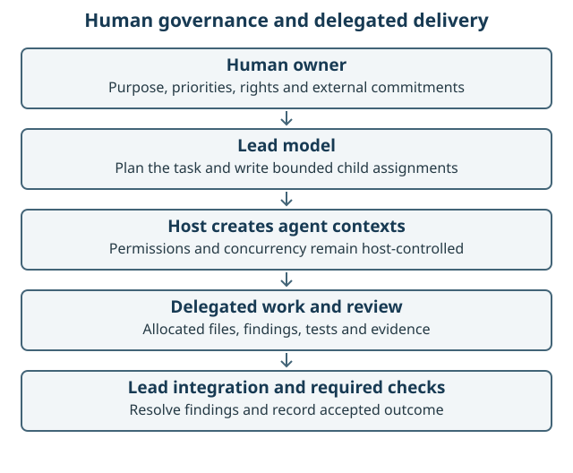
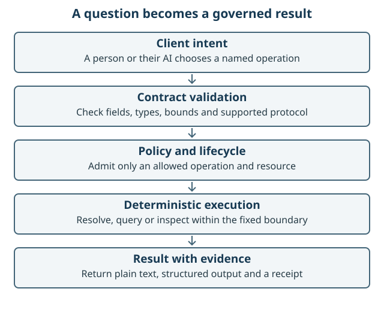
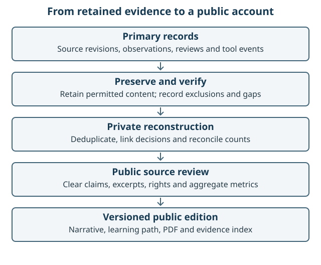

# The story of the build

## A service that can explain its answers

The starting question was broader than how to expose a geospatial function to an
AI assistant. How could a person, ordinary software and an AI client discover the
same governed information, understand its rights and limitations, and inspect why
a result was allowed? GIS AI GO joined an Open Knowledge Framework (OKF) catalogue
to a Model Context Protocol (MCP) interface around that question.

The catalogue describes available knowledge. MCP gives a client a structured way
to discover and call operations. Neither creates permission by itself. The
implementation adds explicit policy decisions, bounded execution and evidence
receipts. The result is a useful distinction between knowing that data exists,
being allowed to request it and proving what a particular request actually did.

The original research was preserved before implementation. Its source ZIP and
checksums remain in the [research provenance record](../research/2026-08-19/PROVENANCE.md).
The successor repository was kept separate from MCP Geo. The earlier repository
could inform design without becoming an uncontrolled import of legacy code.

## 19 to 20 August: establish authority, then ship something useful

The first repository commit is dated 19 August 2026. Stage 0 established source,
licence and verification foundations. [ADR-0004](../decisions/ADR-0004-public-autonomous-delivery.md)
then gave Codex authority to manage issues, branches, reviews and releases within
specified boundaries. This is a central piece of the story: a person delegated
implementation activity while retaining decisions about rights, paid services,
protected data and external obligations.

The first useful product was a static public Explorer. People could browse
catalogue records without an AI account or MCP client. It was built from a
checksum-verified OKF bundle and tested for browser behaviour, source integrity,
accessibility and publication controls. The release process retained an exact
artefact, deployed it, rehearsed rollback and restored the intended version.
[The v0.1.0 release record](../operations/V0.1.0_RELEASE_EVIDENCE.md) ties that
public product to its source, checks and published bytes.

Figure 1. The owner defines authority and purpose. The lead agent organises work,
delegated agents return evidence, automated checks test the result and the lead
agent integrates it. Each transition has an observable record. A diagram of
responsibility is not evidence that every historical action followed it perfectly.

## 20 to 24 August: build the governed execution boundary

The MCP work grew through small accepted components: shared contracts, a catalogue
application, canonical receipts, a durable ledger, a deterministic Python service,
provider adapters, policies and a tool registry. The Git ledger records the
sequence; it should not be read as a timesheet. A commit time says when a change
was recorded, not how many hours were spent producing it.

The registry defined twelve profiles but the read-only release targeted five:
`catalogue.search`, `catalogue.describe`, `selection.resolve`, `data.query` and
`evidence.inspect`. The other seven stayed planned. An implemented function could
also remain unavailable until its activation evidence was sufficient. That is
why an early client sometimes discovered nothing even when substantial code
already existed: implementation and permission to advertise were distinct states.
[ADR-0009](../decisions/ADR-0009-read-only-mcp-tool-lifecycle.md) records the decision.

Receipts made the boundary inspectable. An answer could bind the catalogue or
resource, normalised parameters, policy decision and result to a content identity.
The ledger and reconciliation work addressed a more difficult question: if the
caller loses the response, how can it inspect the earlier receipt without silently
performing the provider operation again? This led to the receipt-only recovery
decision in [ADR-0012](../decisions/ADR-0012-receipt-only-lost-response-reconciliation.md).

Figure 2. A client requests an operation. The service validates the request,
applies policy, resolves or queries within the allowed boundary and returns a
result with evidence. The AI supplies intent; deterministic code enforces the
data operation and limits.

This structure produced many tests and small integration steps. It also produced
complexity. The later code review finds that evidence replay and repeated build
preparation deserve optimisation. Thoroughness has value when it catches a
specific failure; repeating work for unchanged inputs has a measurable cost.

## 23 to 28 August: a client can connect before it can complete the task

Claude interoperability exposed a distinction that beginners often miss. A client
may start a server, negotiate a protocol and list tools yet still fail the intended
five-operation task. Readiness evidence therefore did not count as full capability.
The public history records changes to protocol negotiation, host identity,
permission aliases, request metadata, turn limits, result schemas and completion
semantics before the accepted exact-five result.

The sequence includes the host's handling of tool-name punctuation and the
difference between a model response stopping to call a tool and an agent loop
finishing successfully. These were engineering contracts to inspect and test,
not behaviours to guess. The [Claude retrospective](CLAUDE_RETROSPECTIVE.md)
reconstructs the attempts and clearly distinguishes receipt evidence from
conversational descriptions and missing records.

The owner repeatedly challenged pauses, repeated authorisation requests, polling
overhead and the number of agents shown in the UI. Those observations belong in
the account of human governance: the owner was actively directing priorities
and questioning the method even while Codex supplied the implementation.
The account cannot honestly describe the entire period as uninterrupted operation
without human intervention.

ChatGPT then supplied a separate exact-five observation through a secure tunnel.
The successful host observation proved that route; it did not establish a deployed
public HTTPS service. [The interoperability record](../operations/QUAL-206_INTEROPERABILITY.md)
keeps those different claims visible.

## 29 August to 1 September: make the ideas demonstrable

The exact-five demonstration was packaged with an illustrated guide. A separate
WebMCP Explorer exposed two read-only page tools over the catalogue. Its accessible
manual interface remained useful where the browser's AI could not call page tools.
The [WebMCP walkthrough](../demonstrations/WEBMCP_EXPLORER_RUN_THROUGH.md) records
browser-specific evidence. Enabling a browser API did not guarantee that a given
AI host would discover or invoke it.

The local container candidate and public-ingress preparation advanced independently
of public hosting. The clean-clone journey then supplied a command that starts a
loopback MCP service for a separate client. [LOCAL-212](../operations/LOCAL-212_CLEAN_CLONE_LOCAL_CANDIDATE.md)
was accepted through PR #112 on 1 September. It exposes all five operations and
three resources using the approved cached-data path, without provider egress.

The limitation matters to a colleague trying it: the data query exercises a
documented fallback after an injected in-memory outage. It is neither arbitrary
geospatial analysis nor a live feed. Its session receipts are removed on orderly
shutdown. Those are explicit properties of the learning candidate, and the
[local-completion plan](LOCAL_COMPLETION_PLAN.md) explains what further support
would require.

## September: preserve the process, then examine it

EVID-211 began preserving selected primary evidence before short-lived material
expired. It retained public-safe exact objects and closed private projections,
recorded exclusions and made verification repeatable. Preservation itself then
needed repairs: the predecessor's byte integrity did not establish semantic
validity, and later work bound excluded projection identities correctly. PR #115
is the cut-off for this volume.

Figure 3. Retention, verification, interpretation and publication are separate
operations. A public claim is linked to a reviewed source. Private records remain
available for authorised analysis without being copied wholesale into the report.

The retrospective is useful precisely because the assurance process can also be
criticised. It asks which failures were avoidable, which checks were essential,
where delegation helped, and where context loading, waiting or repeated builds
consumed time. Missing costs stay missing. A successful test after a repair does
not retrospectively make an earlier failure a success.

## 14 September: a model change becomes part of the method

The owner moved the task to GPT-6 Astra with the host setting described as Ultra.
The project guidance was audited against current official recommendations. The
first changes make authorisation continuity explicit, reduce repeated historical
context loading, scope local checks to changes and clarify delegation ownership.
[The guidance review](GUIDANCE_REVIEW.md) records the exact scope and an evaluation
plan; it does not claim an improvement merely because a different model is selected.

## What this case can teach

The evidence supports a substantial example of autonomous implementation under
human governance. It shows one way to make an agent's output inspectable through
contracts, source identities, code review and repeatable checks. It also shows
that the controls themselves need usability, maintainability and cost scrutiny.

The proposed next stage combines a supportable local product with targeted
modularisation. It keeps the learning demonstration available while the hosted
service awaits its operating authority. The public narrative should earn the
description "exemplar" by exposing its evidence and weaknesses, rather than
using that description as a substitute for assessment.
