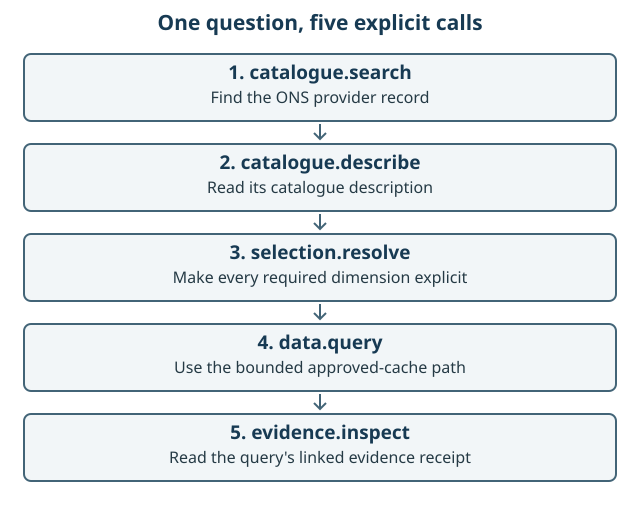
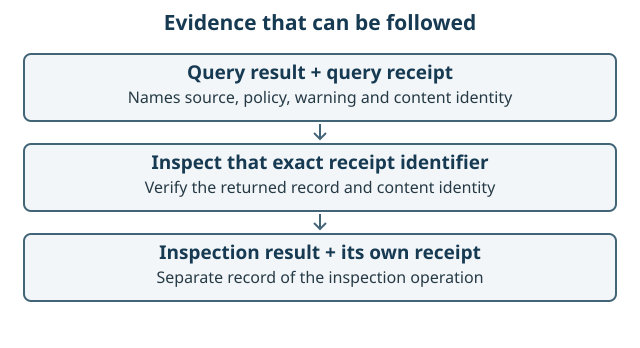
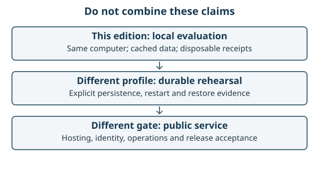

# GIS AI GO: your first governed MCP journey

LOCAL-214 learning edition. Proposed edition: `v0.2.0-local.1`.
Software version: `0.1.0`. Target public release: `0.2.0`.
This guide does not certify that the prerelease has been published or accepted.
The generated PDF's first page identifies its source revision and build inputs.
Use the [acceptance and hand-off record](../operations/LOCAL-214_ACCEPTANCE.md)
for remaining gates and [ADR-0017](../decisions/ADR-0017-local-evaluation-edition.md)
for the accepted local-edition boundary.

## What you will demonstrate

Run a server on your own computer, find a catalogue record, turn a complete
selection into a permitted query, retrieve one approved cached observation and
inspect the evidence. A deterministic client runs the five calls. You do not need
an AI subscription, hosting, Docker, provider credentials or an external SSD.



The example is ONS weekly deaths: England, 2026, week 24, all causes, dataset
version 121. Its captured value is `10471`. That is an historical observation for
learning, not a current statistic or advice. The cache records retrieval on
20 August 2026 and permits this profile's use only before
`2027-02-20T20:21:08.947Z`. An expiry policy is not a statement that data is current.

This is a disposable local evaluation, not a supported public MCP service.
`127.0.0.1` means this computer only. A remote chatbot cannot normally reach it.
The separate WebMCP workbench and Sites deployment are not part of these steps.

<!-- page -->

## 1. Obtain identified source and install

The baseline prerequisites are Git, Node.js `24.19.0`, pnpm `10.33.2`,
Python 3.12 or later and uv `0.12.2`. Check before installing:

```bash
git --version
node --version
pnpm --version
python3 --version
uv --version
```

The local development environment uses Node.js `26.7.0`; canonical Linux CI pins
`24.19.0`. These are distinct test environments, not a blanket compatibility claim.
Use the exact edition's acceptance record for tested operating systems. macOS
arm64 and Linux need independent recorded checks; Windows is not claimed.

For a source checkout:

```bash
git clone https://github.com/chris-page-gov/gis-ai-go.git
cd gis-ai-go
git rev-parse HEAD
```

Compare the printed commit with the edition's acceptance record before proceeding.
Cloning the default branch alone does not select an immutable edition. Before a
prerelease exists, a checkout is a development candidate, not a released package.

For a published LOCAL-214 source archive, first check its downloaded `SHA256SUMS`
against a trusted release record. On macOS use `shasum -a 256 -c SHA256SUMS`; on
Linux use `sha256sum -c SHA256SUMS`. Extract it and enter its directory:

```bash
tar -xzf gis-ai-go-v0.2.0-local.1-source.tar.gz
cd gis-ai-go-v0.2.0-local.1
python3 -m scripts.local214_package verify
```

The verifier checks the source inventory and identity. A digest detects changed
bytes; it does not by itself authenticate the publisher. The package contains
source, not trusted prebuilt JavaScript. Both routes then use the lockfiles:

```bash
pnpm install --frozen-lockfile
uv sync --locked --group dev --cache-dir .uv-cache
```

Installation can contact package registries. The subsequent provider-free
demonstration uses an in-memory outage and approved cache, not an ONS network call.
Do not add secrets or copy somebody else's dependency or build directories.

<!-- page -->

## 2. Start and check the server

In the source directory, run the maintained launcher and leave this terminal open:

```bash
./scripts/start-local-candidate
```

The launcher rebuilds from source and creates owner-only temporary session state.
Read its startup record. It must show the fixed loopback endpoint,
`candidate-unregistered`, `production_registration: false` and
`provider_egress: false`. Its software version remains `0.1.0`; the target is
`0.2.0`. These deliberately different labels are not an installation error.

Open a second terminal in the same source directory:

```bash
curl --fail --silent --show-error \
  http://127.0.0.1:8787/healthz | python3 -m json.tool
curl --fail --silent --show-error \
  http://127.0.0.1:8787/readyz | python3 -m json.tool
```

Health asks whether the process is alive. Readiness asks whether the governed
assembly and evidence dependencies are usable. The local capability information
also reports cache vintage, expiry and data-query availability. Do not treat an
alive process as permission to retrieve expired data. Existing session evidence
can remain inspectable after query expiry. Never change the clock or weaken an
approval to force a pass.

## 3. Run the five calls

Still in the second terminal, run the included local MCP client:

```bash
node scripts/local214_demo.mjs
```

The client uses the repository's pinned SDK and the fixed
`http://127.0.0.1:8787/mcp` endpoint. It needs no AI model. Read its actual JSON
summary; this guide intentionally does not invent a sample success transcript.
Success requires all five calls, their checked results and the negative cases,
not just a successful HTTP connection.

Discovery must expose exactly five tools and three resource classes:

| Tools that perform the journey | Resources that can be read |
| --- | --- |
| `catalogue.search`, `catalogue.describe` | `catalogue.public`, `catalogue.record` |
| `selection.resolve`, `data.query`, `evidence.inspect` | `evidence.receipt` |

Stop and retain the output if counts differ or a provider key is requested.

<!-- page -->

## 4. Understand the observation and receipt

The search finds `PV-ONS-DATA`; description explains that provider record.
Selection supplies dataset `weekly-deaths-region`, edition `time-series`,
version `121`, geography `E92000001`, time `2026`, week `week-24` and
cause of death `all-causes`. The query receives the selection's explicit
`data_query` parameters and a new idempotency key.

The local transport returns a deterministic in-memory HTTP `503`. This exercises
the approved fallback path without contacting ONS. The receipt records
`read-approved-provider-cache`. The inherited warning says "The ONS request
failed"; here it refers to that simulated outage, not a failed network request.



The client checks that the receipt inspected is the query's receipt, that its
content identity recomputes correctly and that plain-text and structured results
are complete. Separate successful calls have separate receipts. This establishes
what this session recorded under its policy, not that data is current, accurate
for a different purpose, or approved for an unrestricted query.

The receipt is an evidence record, not a password, digital signature, permanent
backup or proof that a public service exists. The edition's demo output includes
the checked public receipts and exact source identity, so saving that output
retains the demonstration's evidence after the disposable server stops. Review
what you save; do not add private paths, personal information or credentials.

## 5. Learn from the refusals

The included client also exercises missing selection constraints, arbitrary input
and reuse of an idempotency key. Read the actual refusal/replay result rather than
expecting the server to guess missing dimensions or silently widen authority.
An idempotency key identifies a logical request; it is not permission to change
the query while keeping the same identity.

An expired cache is a separate boundary: `data.query` fails closed at or after
`2027-02-20T20:21:08.947Z`. The repository owner must arrange a reviewed,
content-addressed renewal through normal assurance. This guide never extends the
historical approval or substitutes a synthetic observation without a new profile.

<!-- page -->

## 6. Stop and check cleanup

Return to the first terminal and press `Control-C` once. Wait for the stopped
record before closing it. Orderly `SIGINT` or `SIGTERM` deletes the session's
temporary ledger and reconciliation state. Receipts do not survive this normal
restart. A crash, power loss or `SIGKILL` is outside that cleanup guarantee.

Afterwards, this command should fail to connect because the server has stopped:

```bash
curl --fail --silent --show-error http://127.0.0.1:8787/healthz
```

For a Git checkout, `git status --short` should show no changes caused by the
journey. For the extracted edition, rerun `python3 -m scripts.local214_package
verify` to check its maintained source. Installed dependencies and generated output
are not attested by that source-only verifier.

## Troubleshooting without widening the boundary

| Symptom | Next action |
| --- | --- |
| A prerequisite is missing or the version is wrong | Install the documented version, then repeat its version check. |
| Port 8787 is already in use | Stop your other known local candidate. Do not kill an unidentified process or change to a public bind address. |
| Health works but readiness fails | Retain output. Recheck the identified source and locked installation; do not bypass readiness. |
| The cache is expired | Keep the refusal. Await an explicitly reviewed renewal; do not change the clock. |
| A remote chatbot cannot connect | Use the included same-computer client. Hosting and tunnels are different governed work. |
| Cleanup reports failure | Treat this as a failed demonstration and retain the error; do not claim clean teardown. |



<!-- page -->

## What makes this governed rather than just connected?

A **contract** is a versioned agreement about allowed input, result and error
shapes. Try one complete selection and one missing a constraint. The refusal
shows that valid JSON alone is not enough to obtain data.

**Governance as code** means the server owns the authority context, evaluates the
allowed operation and carries obligations into evidence. A model's persuasive
request cannot grant itself permission. Catalogue discovery is not authorisation.

An **AI client** can translate a person's question into these tool arguments. The
deterministic selection and retrieval code, not the model, performs this bounded
operation. This guide proves the protocol path without paying for an AI call.
A client may display dots as underscores; the five governed capabilities remain
the same. Follow the [client guide](../operations/LOCAL-212_CLEAN_CLONE_LOCAL_CANDIDATE.md)
when connecting a particular local MCP client.

Different checks answer different questions: unit tests cover small decisions;
contract tests cover message shapes; integration tests cover linked components;
adversarial tests cover refusals; dependency and security scans expose other
risks. No single passing check proves that all defects have been eliminated.

The [learning path](../chronicle/LEARNING_PATH.md) and
[agent history](../chronicle/AGENT_HISTORY.md) explain how the lead coding model
delegated bounded tasks to child agents, reviewed results and integrated changes
under human governance. Historical agent totals do not mean that those agents
were all working at once. A clean-room agent review is not an unaided human
usability study; the edition's acceptance record must distinguish them.

## Sources and verification boundaries

- [LOCAL-212 maintained runbook](../operations/LOCAL-212_CLEAN_CLONE_LOCAL_CANDIDATE.md): launcher, client, session and network boundaries.
- [ADR-0015](../decisions/ADR-0015-provider-free-loopback-local-candidate.md): the accepted provider-free architecture.
- [LOCAL-214 completion plan](../chronicle/LOCAL_COMPLETION_PLAN.md): separate edition gates and limits.
- [Approved cache](../../providers/ons/data-query-approved-cache.v1.json): exact observation, original source, retrieval and expiry.
- [Local acceptance tests](../../apps/mcp-gateway/test/local-candidate-acceptance.test.ts): independent governed journey.
- [Local demo client](../../scripts/local214_demo.mjs): reproducible second-terminal checks.

The figures are explanatory vector diagrams, not screenshots of an observed
client. Build inputs and PDF hashes are recorded in the generated guide manifest.
The PDF is reproducible with the pinned optional print dependencies; generating
it does not publish an edition, create deployment evidence or mark a check passed.

Maintainers can build it with:

```bash
python3 -m scripts.build_local214_guide --check
python3 -m scripts.build_local214_guide \
  --output-dir artifacts/local214-guide/output/pdf
```

The optional print dependency versions are in
[requirements-print.txt](../chronicle/requirements-print.txt). Install them only
in a separate documentation environment. Source-only packaging uses
`python3 -m scripts.local214_package package --output-dir` followed by a new
directory outside the checkout; the packager requires clean committed source.
