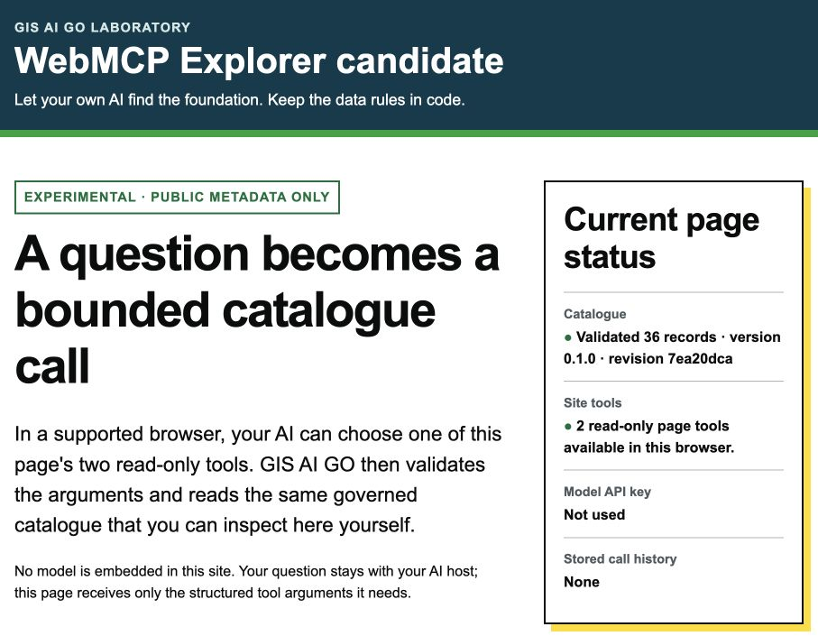
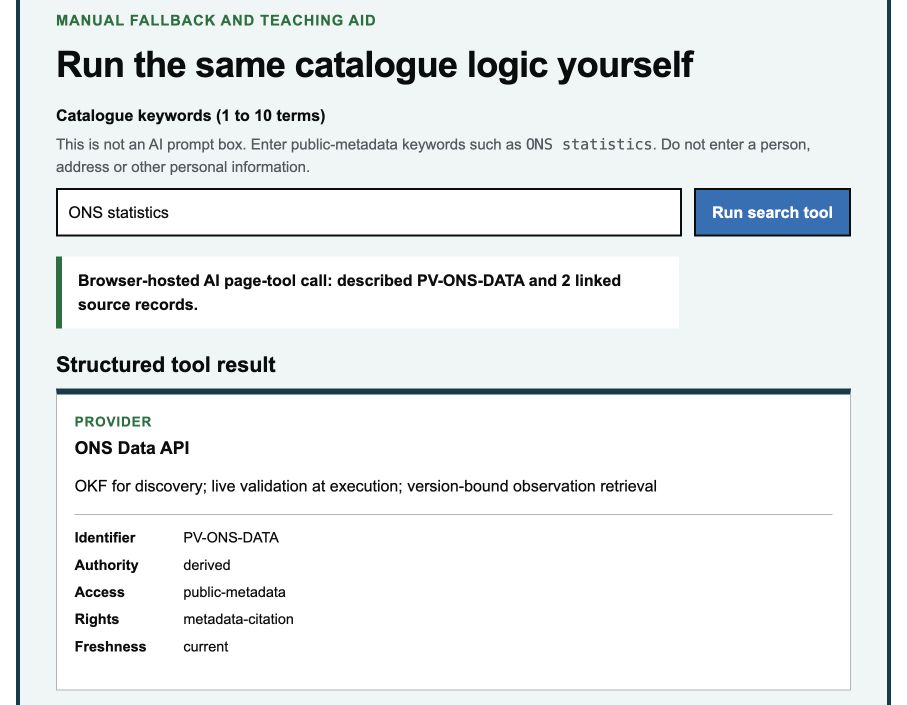
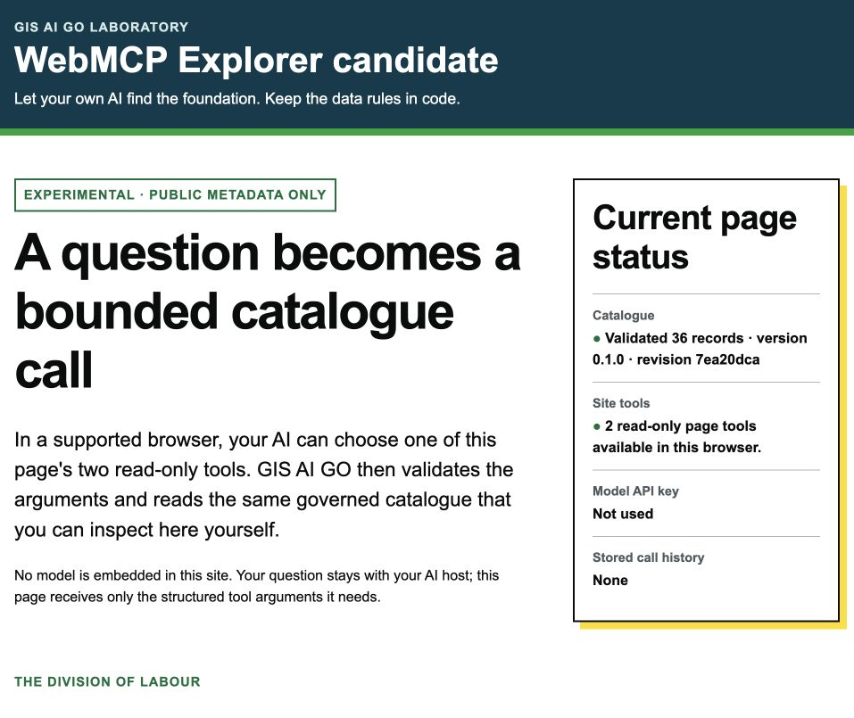
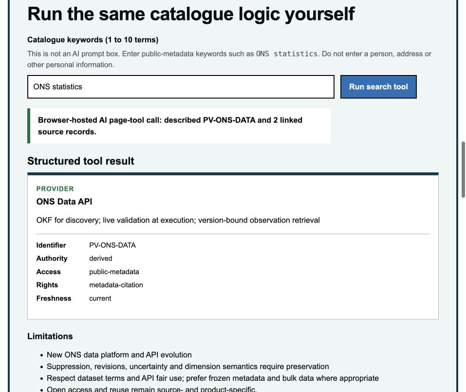
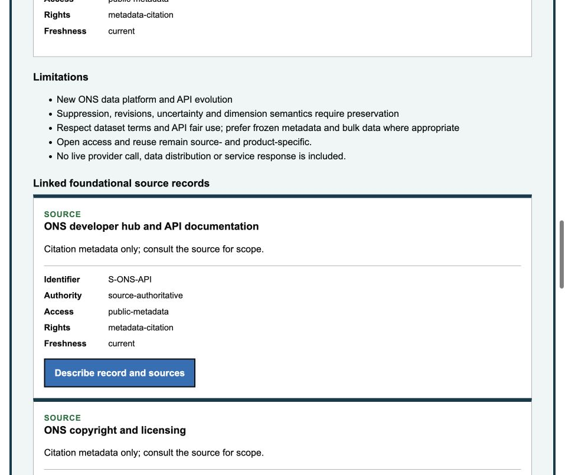
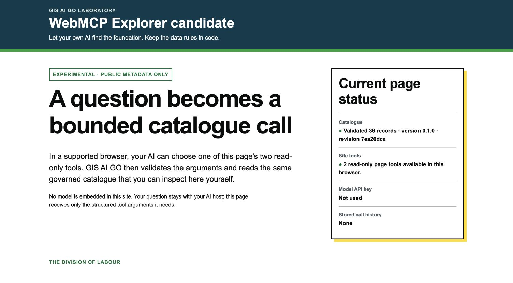
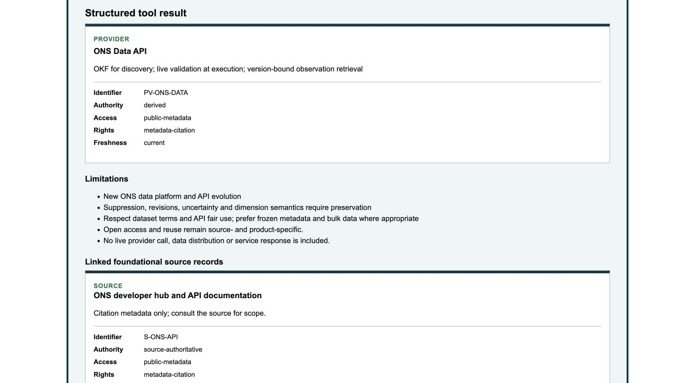
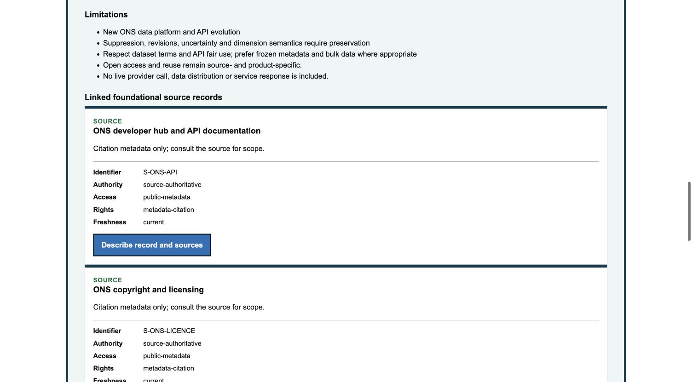
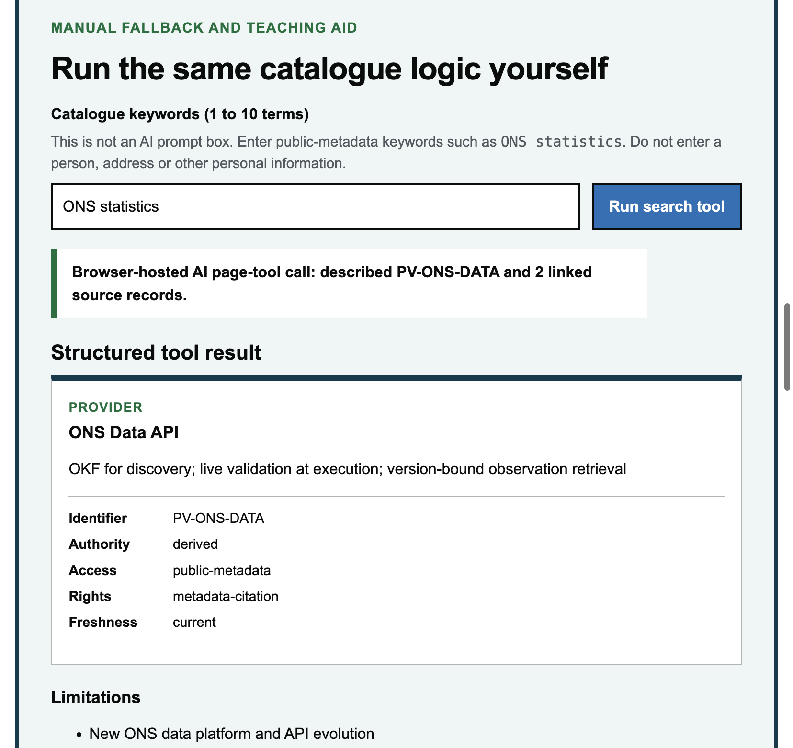

# GIS AI GO WebMCP Explorer: beginner's illustrated run-through

> **Status:** experimental demonstration guide, revised from observations made on
> 29 August 2026. WebMCP is a developing specification, not a W3C Recommendation.
> The Explorer exposes bounded public catalogue metadata; it is not the persistent
> GIS AI GO MCP service.

Demonstration Site:

<https://gis-ai-go-webmcp-explorer.crpage.chatgpt.site/demo>

> **Access boundary:** this is an owner-only private Sites deployment. It requires
> the authorised OpenAI account, and people who have not been granted access
> cannot use the link. Do not present it as a public demonstration or LinkedIn
> destination unless its access is explicitly changed and the public journey is
> then re-tested.

This guide explains what was proved, what was not proved, and how to repeat each
part of the demonstration without confusing the website, the browser API, the
browser's developer interface and the AI host.

## Read this first: there are four separate planes

The most important idea is that “WebMCP works” can mean four different things.
Success in one plane does not prove success in the next.

| Plane | What it is | What a pass proves |
|---|---|---|
| 1. Visible website | The ordinary page, buttons and manual catalogue field | A person can use the demonstration without any AI or WebMCP support |
| 2. Native browser API | `document.modelContext` and its registered page tools | The browser can discover and execute the page's structured tools |
| 3. Developer inspection | Chrome DevTools **Application > WebMCP**, or optional external automation | A debugging or automation interface can display or drive the native API |
| 4. AI-host integration | A verified host, such as the observed Codex Site-tools surface, exposes page registrations in an AI's callable tool list | That particular AI host, version and session can select and call the tools; a named but unverified host cannot inherit the result |

For example, Chrome's native API passed the current test, while Gemini in Chrome
reported that the environment connecting it to the tab exposed no page-tool
declarations and made no GIS AI GO tool call. Those results are compatible: the
browser API can be working even when a particular AI-host bridge is not observed.

## Current evidence at a glance

The following are exact observations, not general claims about all future
versions:

- **Codex built-in browser Site tools — passed.** The host discovered exactly
  `explorer_search_catalogue` and `explorer_describe_record`. It successfully
  searched for `ONS statistics`, returned `PV-ONS-DATA`, described that record
  and updated the visible page. The description contained five limitations and
  two linked foundational source records.
- **Chrome `152.0.7977.64` native WebMCP API — passed.** In the page's main
  JavaScript world, `document.modelContext` existed; `registerTool`, `getTools`
  and `executeTool` were functions; exactly the two intended tools were
  discovered; and both exact tool calls succeeded.
- **Chrome DevTools — not established for exact main.** A WebMCP navigation item
  was seen in an earlier session, but the retained clean evidence does not show the
  WebMCP pane selected against this exact revision. Do not claim a pass or a blank
  exact-main pane.
- **Gemini in Chrome — no WebMCP bridge observed.** After Chrome was fully
  relaunched, the native API and both bounded page-tool calls passed again. In
  the separate Gemini session on 29 August 2026, Gemini reported that its host
  function list contained only standard Google web search and no page-tool
  declarations; no page-tool invocation occurred. Gemini's product or model
  version was not exposed. This is an observed host limitation for that session,
  not proof that Gemini never supports WebMCP. Chrome's own
  [WebMCP documentation](https://developer.chrome.com/docs/ai/webmcp) explicitly
  distinguishes its WebMCP test agent from Gemini in Chrome features.
- **Edge Stable `152.0.4191.53` native WebMCP API — passed in this exact
  observed local environment.** The manual fallback passed. In the page's
  main JavaScript world, `document.modelContext.getTools()` discovered exactly
  the two intended tools and both bounded `executeTool()` calls succeeded. The
  separate Edge DevTools and AI-host planes were not tested. This exact-version
  observation does not establish general Edge Stable or Copilot support.
- **Edge `151.0.4129.107` native WebMCP API — passed historically.** The same
  bounded native calls passed before the Stable update; that older observation
  is retained for comparison rather than inherited by another version.

The exact private deployment observed in these tests was:

| Evidence identity | Exact value |
|---|---|
| Private Sites version | `4` |
| Site wrapper commit | `91bcdf758e4784022d3e474be575103fae306682` |
| GIS AI GO protected-main revision | `7ea20dca9f50594ac9a587b062bfc4a3239a94de` |
| Revision displayed by the page | `7ea20dca` |
| Saved Sites version ID | `appgprj_6a92b570182c8191a5c4b0fd6260e668~appgver_524260e16630819192a14dfdb900bf63` |
| Sites deployment | `appgdep_6a92dc6a4a8c819199ee2ab9f53d7254`, succeeded at `29 August 2026, 13:19:50 UTC` (`14:19:50 BST`) |
| Saved archive content hash | `sha256:69432632dc8ce0c28626b4bdac68b7f9b62060dc0a6308ccd4bbc59dde0c0a43` |
| Static content root | `480e1e4b6b31475ff932c439e57502c34e840c6047ab711d13820a2900bcc70c` |
| Verified access policy | one owner, no groups and no external visitors |
| Observation date | `29 August 2026` |

A later deployment, wrapper commit, source revision or browser version must be
re-tested rather than inheriting these results.

## What the two tools do

The page exposes exactly two read-only tools:

| Tool | Purpose |
|---|---|
| `explorer_search_catalogue` | Search validated public GIS AI GO catalogue metadata and return no more than five compact records |
| `explorer_describe_record` | Read one exact catalogue record, including authority, access, rights, freshness, limitations and linked sources |

Both tools are labelled read-only and untrusted-content. They do not call a data
provider, create a durable receipt, use a privileged credential, change a
service or continue after the page is closed.

```text
Page-scoped WebMCP demonstration      Persistent GIS AI GO MCP service
--------------------------------     --------------------------------
Visible catalogue of public metadata Independently callable runtime
Page lifetime only                   Provider admission and operations
No durable receipt                   Durable evidence and receipts
No provider credential               Controlled provider credentials
```

## A common source of confusion: two different input boxes

There are two valid ways to ask for the same information, but the text belongs
in different places.

### In an AI conversation

Use a complete natural-language request. For this demonstration, send:

> Use Site tools. Search the catalogue for `ONS statistics`, filter to
> `provider`, then describe the most relevant record, including its sources and
> limitations.

If an AI-host bridge is available, the host can translate that request into the
structured arguments required by the page tools.

### In the page's manual catalogue field

Enter only concise catalogue keywords:

```text
ONS statistics
```

The manual field is not an AI prompt box. It accepts between 1 and 10 catalogue
keywords, with a maximum of 256 characters. Pasting the full natural-language
request into that field should be rejected. That rejection proves only the
manual field's 256-character and 10-normalised-term validation. It neither proves
nor disproves an AI-host bridge.

## Demonstration 1: Codex built-in browser

### What “Site tools” means

In this observation, **Site tools** was the Codex label for page tools exposed by a
compatible website. It is not another website, browser extension or conventional
remote MCP server.

OpenAI's documented route is:

1. Open the demonstration URL in the browser panel attached to the Codex
   conversation. ChatGPT documents the same route, but requires a separate
   observation before it can inherit this pass result.
2. Wait for the page to finish loading.
3. In the built-in browser's address bar, select **Site tools**.
4. Expand **Available site tools**.
5. Confirm that exactly two read-only tools are shown:
   `explorer_search_catalogue` and `explorer_describe_record`.
6. Return to the conversation, keeping the Site open, and send the complete
   natural-language request shown above.
7. Review any proposed call and its arguments before allowing it to run.

If the **Site tools** control is absent, check the desktop app version, selected
model, workspace availability and the browser permission for Site tools. See
[OpenAI's Site tools guide](https://learn.chatgpt.com/docs/webmcp) for the
current availability rules; these can change independently of the Site.

This clean capture was taken during the private Sites version-4 observation. The
page itself shows the protected-main revision and two read-only page tools; the
deployment and access records, not the image alone, establish version and
privacy. It is page-content evidence;
the separate Site-tools host inventory and calls were observed directly but are
not visible in this image.



### Expected structured calls

The exact successful search observation used:

```json
{
  "query": "ONS statistics",
  "facets": {
    "types": ["provider"]
  },
  "limit": 5
}
```

It returned `PV-ONS-DATA`. The next call used:

```json
{
  "record_id": "PV-ONS-DATA"
}
```

Equivalent valid, bounded search arguments can be conformant; an AI host is not
required to reproduce a single word-for-word mapping. The outcome must still
identify the intended record without adding an unrequested provider call.

### Acceptance checks

A successful run must show all of the following:

- exactly the two expected read-only tools and no write or administration tool;
- a search result containing `PV-ONS-DATA`;
- a description containing authority, access, rights, freshness, all five
  limitations and two linked foundational source records;
- a visible page update corresponding to each tool call;
- explicit boundary values showing no provider call, durable receipt or
  persistent service; and
- an AI explanation that agrees with the structured result and does not invent
  a production capability.

Afterwards, select **Site tools > Recently used** if that control is available
in the current app. Confirm that only the intended calls appear. Navigate away
from the page and confirm that its page-scoped tools are no longer available.

## Demonstration 2: the ordinary manual page

This is Plane 1 and requires no AI integration.

1. Open the demonstration URL in a normal browser.
2. Find **Catalogue keywords (1 to 10 terms)**.
3. Enter `ONS statistics` — not the full natural-language question.
4. Select **Run search tool**.
5. Find `PV-ONS-DATA` and select **Describe record and sources**.
6. Review its authority, rights, freshness, five limitations and two linked
   foundational source records.
7. Confirm the page still describes the boundary as page-scoped and read-only.

This proves that the demonstration remains understandable and usable when
WebMCP or an AI bridge is unavailable. It does not prove native WebMCP support.

The following clean capture shows the exact version-4 manual field and the
visible result after a built-in-browser page-tool call. It does not show the host
tool menu or call arguments.



## Demonstration 3: native Chrome 152 API

The following result applies specifically to Chrome `152.0.7977.64`.

### Configure the test profile

Changing Chrome flags affects the selected Chrome profile and requires a full
relaunch. Save open work first.

1. Open `chrome://flags/#enable-webmcp-testing`.
2. Set **WebMCP for testing** to **Enabled**.
3. Relaunch Chrome.
4. Reopen the flag URL and confirm the setting persisted.
5. Load the private demonstration Site in the authenticated profile.

The DevTools WebMCP navigation feature was present in the tested Chrome 152
profile. The exact
[Chromium change](https://chromium.googlesource.com/chromium/src/+/1ddb706a3498463d86d39257c243367b2f34947f)
is useful implementation background, but does not prove the selected pane's
behaviour in this profile.
If the **Application > WebMCP** navigation item is missing, inspect
`chrome://flags/#devtools-webmcp-support`; an explicit override may be useful for
diagnosis, but it is a separate plane from the native page API.

Remote debugging is not required for this manual native-API test. Enabling an
external automation connection is a separate security decision because it can
expose an active browser session, cookies and signed-in pages to that automation
process.

### Run the main-world preflight

Open DevTools for the Site and run this in **Console**:

```js
({
  userAgent: navigator.userAgent,
  secureContext: isSecureContext,
  https: location.protocol === "https:",
  topLevel: self === top,
  originAgentCluster: window.originAgentCluster,
  modelContext: typeof document.modelContext,
  registerTool: typeof document.modelContext?.registerTool,
  getTools: typeof document.modelContext?.getTools,
  executeTool: typeof document.modelContext?.executeTool
})
```

For the exact successful observation:

- `secureContext`, `https`, `topLevel` and `originAgentCluster` were `true`;
- `modelContext` was `"object"`; and
- `registerTool`, `getTools` and `executeTool` were `"function"`.

This clean page capture was taken during the version-4 observation and shows the
matching source revision and two registered read-only tools. It does not
independently prove Chrome identity, Site version or access policy, and it does
not substitute for the
main-world Console inventory recorded in the observation.



Run the probe in the page's **main JavaScript world**. Some test automation runs
code in an isolated world and can misleadingly report `document.modelContext` as
missing even when the page and native API are working.

### Discover the tools

```js
const tools = await document.modelContext.getTools();
tools.map(({ name, description, inputSchema, annotations }) => ({
  name,
  description,
  inputSchema,
  annotations
}));
```

Pass only if the two intended names are present and no extra tool is exposed.
Do not require a particular list order.

### Execute the exact search

Chrome 152's native `executeTool()` uses JSON strings:

```js
const search = tools.find(
  tool => tool.name === "explorer_search_catalogue"
);

const searchRaw = await document.modelContext.executeTool(
  search,
  JSON.stringify({
    query: "ONS statistics",
    facets: { types: ["provider"] },
    limit: 5
  })
);

const searchResult = JSON.parse(searchRaw);
searchResult;
```

The exact observation returned `PV-ONS-DATA`, reported the deployed revision and
set `provider_call`, `durable_receipt` and `persistent_service` to `false`. The
visible page also updated.

### Execute the exact description

```js
const describe = tools.find(
  tool => tool.name === "explorer_describe_record"
);

const describeRaw = await document.modelContext.executeTool(
  describe,
  JSON.stringify({ record_id: "PV-ONS-DATA" })
);

const describeResult = JSON.parse(describeRaw);
describeResult;
```

The exact observation returned the record's authority, access, rights,
freshness, five limitations and two linked foundational source records, and
produced the matching visible page update.

The next two clean captures show that visible state. They are page-state evidence
paired with the separately recorded native `document.modelContext` calls; they
do not display the Console arguments themselves.





This is the strongest current Chrome evidence. It proves native browser
discovery and execution on one exact version, profile, Site and build. It does
not prove that Gemini in Chrome can call the tools.

## Demonstration 4: Chrome DevTools WebMCP panel (evidence pending)

Chrome's [WebMCP documentation](https://developer.chrome.com/docs/ai/webmcp)
describes its testing and inspection surfaces. The retained clean evidence does not establish the panel outcome for exact
protected main. An earlier session showed a WebMCP navigation item, but its image
had another DevTools item selected and therefore cannot prove either a working or
blank WebMCP pane. The native Console evidence above remains valid and separate.

To capture this plane, open DevTools on the exact Site tab, select
**Application > WebMCP**, reload once with DevTools open, and capture the full pane.
Record what is actually visible as passed, blank or unsupported.

Do not write “Available Tools showed two tools” or “Invoked Tools recorded two
calls” until those items are actually visible in a fresh, exact-version capture.

Useful checks for a blank panel are:

- verify that DevTools is attached to the Site tab, not a flag or `about` tab;
- reload the Site with DevTools already open;
- confirm the native main-world probe still passes;
- check for DevTools errors without changing the page's security controls; and
- record the Chrome version, profile and flag state before retrying.

## Gemini in Chrome: what the result means

After a full Chrome relaunch, the page's main-world native API still exposed exactly
the two intended tools and both bounded calls passed. In the separate observed
Gemini session on 29 August 2026, Gemini reported that the environment connecting it
to the tab exposed only standard Google web search and no page-tool declarations. No GIS AI
GO page-tool invocation occurred. Gemini's description of a missing adapter or
function injection is its own diagnosis, not independently verified architecture.

This is evidence about **Plane 4, Gemini's host integration**. It is not evidence
that the Site failed or that Chrome's native WebMCP API failed. Both the Site and
Chrome native API had already passed their separate checks.

Chrome's [WebMCP guide](https://developer.chrome.com/docs/ai/webmcp) describes a
WebMCP test agent and explicitly says that it is separate from Gemini in Chrome
features. Google's [May 2026 announcement](https://developer.chrome.com/blog/chrome-at-io26)
says Gemini in Chrome "will soon support" WebMCP. The current
[Gemini in Chrome help](https://support.google.com/chrome/answer/16283624?hl=en-GB)
reviewed on 29 August documents tab sharing and auto browse, but identifies no
WebMCP switch. Do not tell users that the WebMCP testing flag, tab sharing, auto
browse or remote debugging enables a Gemini-to-WebMCP bridge.

### Design consequence

No GIS AI GO implementation change is justified by this result. The page already
does the two things it should do: it exposes a standards-shaped native API and
retains a complete manual fallback. For Gemini to invoke the tools, an active
Gemini host bridge would need to expose those page registrations as callable
tools. The observed Gemini session did not do so. Adding a GIS AI GO browser
extension or remote bridge merely to compensate would create a new permission
and trust surface, so it is not part of this bounded candidate.

For a current demonstration of “the user's own AI selects a page tool”, use the
observed Codex Site-tools journey. Present the Chrome `152.0.7977.64` and Edge
`152.0.4191.53` native results as recorded version-bound observations, retaining
the Edge local-environment caveat below. Present Gemini as an honest client-gap
observation until a later version exposes and successfully invokes the page tools.

## Edge validation

### Observed Edge 152 Stable result

Edge `152.0.4191.53` (arm64), released on 27 August 2026 and installed on this
Mac, passed the bounded retest on 29 August 2026. The result is specific to the
exact observed local environment; the API-enablement mechanism was not
established.

The manual fallback passed first:

- searching for `ONS statistics` returned five bounded catalogue records;
- the exact `PV-ONS-DATA` card was selected;
- the manual describe action displayed all five limitations; and
- both linked source records, `S-ONS-API` and `S-ONS-LICENCE`, were visible.

The separate native main-world observation then established that:

- the page was top-level, HTTPS, a secure context and origin-agent-clustered;
- `document.modelContext`, `registerTool`, `getTools` and `executeTool` existed;
- `getTools()` returned exactly `explorer_search_catalogue` and
  `explorer_describe_record`, with no hidden third tool;
- the discovered `inputSchema` values and `executeTool()` arguments used JSON
  strings in this Edge build;
- the exact provider-filtered search returned `PV-ONS-DATA` from revision
  `7ea20dca9f50594ac9a587b062bfc4a3239a94de`;
- the describe call returned authority `derived`, access `public-metadata`,
  rights `metadata-citation`, freshness `current`, five limitations and both
  linked ONS source records; and
- both calls preserved the page-scoped boundary: no provider call, durable
  receipt or persistent service, with a corresponding visible page update.

The Site had neither an `Origin-Trial` response header nor an origin-trial
`meta` element during this observation. That absence does not identify whether a
flag, command-line option or managed browser setting enabled the API; it does
mean this result is not evidence that the Site enrolled in Microsoft's origin
trial. No Edge DevTools pane or Edge AI-host bridge was tested, and no Copilot
interoperability claim follows.

These clean page captures show the exact revision and visible result. They do
not independently prove browser identity, the main-world inventory or the call
arguments; those were recorded separately in the bounded observation.







### Observed Edge 151 result

Edge `151.0.4129.107` passed the bounded native test on 29 August 2026:

- `document.modelContext` was available;
- exactly `explorer_search_catalogue` and `explorer_describe_record` were
  discovered;
- the bounded search returned `PV-ONS-DATA`; and
- the describe call returned the record, five limitations and two linked
  foundational source records, with the corresponding visible page update.

The following clean capture is the visible page state after the Edge 151 native
describe call. It does not show the native tool inventory or arguments, which
were observed separately.



This exact-version pass must not be generalised to every Edge version merely
because Edge uses Chromium.

### Microsoft status and a repeatable Edge check

Microsoft's
[Stable release notes](https://learn.microsoft.com/en-us/deployedge/microsoft-edge-relnote-stable-channel)
list Edge `152.0.4191.53`, released on 27 August 2026. Microsoft uses progressive
rollout, so another device can legitimately remain on the previous version
temporarily.

Microsoft's
[Edge 152 platform notes](https://learn.microsoft.com/en-us/microsoft-edge/web-platform/release-notes/152)
list WebMCP under origin trials rather than generally available stable APIs.
Microsoft exposes the trial through an
[experimental Edge origin trial](https://developer.microsoft.com/en-us/microsoft-edge/origin-trials/trials/0b76fe60-b266-458e-a285-04e375c0c31a),
which expires on 17 November 2026. That is not evidence of universal stable
support, and an empirical test flag is not equivalent to origin-trial
participation.

For a bounded repeat observation:

1. Record the installed Edge version and whether it is Stable, Beta, Dev or
   Canary.
2. Open the Site and complete the ordinary manual journey with `ONS statistics`.
3. Open DevTools **Console** and run the main-world preflight from the Chrome
   section.
4. If `document.modelContext` is `undefined`, record native WebMCP as unsupported
   in that exact Edge version; do not classify it as a Site failure.
5. If it exists, discover the complete tool inventory and execute both bounded
   calls before making any native-support claim.
6. Record visible page effects, Console errors and any relevant feature setup.

No reviewed Microsoft source prescribes an `edge://flags` setting or Edge policy
as the Edge 152 activation route. Do not copy Chrome flag instructions into Edge
unless Microsoft documents an equivalent or the exact Edge build exposes and
identifies it. Describe a successful locally configured test as a native API
observation under that experimental environment, not as general Edge support or
Copilot interoperability.

## Compatibility matrix

| Host or surface | Manual page | Native page API | DevTools presentation | AI-host bridge | Honest current status |
|---|---:|---:|---:|---:|---|
| Codex built-in browser, Sites version 4 | Yes | Host-managed | Not applicable | Yes | **Passed:** exactly two read-only tools; search and describe calls returned `PV-ONS-DATA`, five limitations and two source records |
| ChatGPT built-in browser | Yes, where private Site access is available | Host-managed | Not applicable | Not yet observed | **Documented repeat route, not yet tested:** do not inherit the Codex pass |
| Chrome `152.0.7977.64`, main-world Console | Yes | Yes | Not required | Not applicable | **Passed:** discovery and both exact native calls succeeded |
| Chrome `152.0.7977.64`, Application > WebMCP | Yes | Yes, proved separately | Exact-main outcome not evidenced | Not applicable | **Pending:** an earlier navigation item does not establish the selected pane on this revision |
| Gemini in Chrome, observed session on 29 August 2026 | Yes | Not part of this interaction; Chrome native passed separately | Not part of this interaction | Not observed | **AI-host bridge not observed:** Gemini reported only Google web search and no page-tool declarations; no invocation occurred |
| Edge `152.0.4191.53` Stable in the exact observed local environment | Yes | Yes | Not tested | Not tested | **Passed on exact version:** manual search and describe passed; native discovery and both exact calls succeeded. The API-enablement mechanism was not established, no origin-trial token was present, and no general Stable or Copilot claim follows |
| Edge `151.0.4129.107`, historical main-world observation | Yes | Yes | Not tested | Not applicable | **Passed on exact version:** discovery and both native calls succeeded before the Stable update |
| Browser with no WebMCP support | Yes | No | Not applicable | No | **Manual fallback:** the visible catalogue journey remains available |

## Troubleshooting by plane

### The full question is rejected on the page

The full question belongs in the AI conversation. In the page's manual field,
enter `ONS statistics`. The field deliberately accepts only 1 to 10 catalogue
keywords and no more than 256 characters.

### Site tools is missing in ChatGPT or Codex

- Confirm the Site itself is the active built-in browser tab and has finished
  loading.
- Check the current Site-tools permission, model and workspace requirements in
  OpenAI's documentation.
- Reload once after changing a browser permission.
- Confirm that the private Site session is still authenticated.

### `document.modelContext` is missing in Chrome

- Confirm the exact Chrome version and that **WebMCP for testing** is enabled.
- Complete a full Chrome relaunch, not merely a page reload.
- Run the probe in the Site's top-level main world, not an iframe or isolated
  automation world.
- Confirm that the Site is loaded over HTTPS.

### Application > WebMCP is present but blank

Treat a genuinely blank selected panel as inconclusive. Use the main-world Console
discovery and execution as the native-API evidence, then preserve the exact panel
outcome for diagnosis. Do not turn the menu item's presence into a successful or
blank-panel claim.

### Gemini says no page tools are available

Record the AI-host bridge as **not observed** for that exact session. Do not keep
retrying the full prompt, weaken the schemas, enable remote debugging, or treat
tab sharing or auto browse as a WebMCP switch. It does not invalidate the separate
Chrome-native or Codex results. Validate the native API directly, or use the
separate Model Context Tool Inspector or the verified Codex Site-tools host for an
agent bridge. Treat the documented ChatGPT route as untested until it has its own
exact observation.

### A call succeeds but the visible page does not change

Treat that run as failed. The demonstration requires the person and AI to share
the same visible state. Record the arguments, output, Site revision and exact
host/browser version before retrying from a fresh page load.

## Screenshot and evidence checklist

Every item below is a **capture task** unless explicitly marked **captured and
verified** in the final evidence manifest. Placeholder labels are not screenshots
and must never be published as though they were.

| ID | Capture task | Required content | Current status |
|---|---|---|---|
| WMCP-00 | Distinguish the two input paths | Full prompt in the AI conversation beside the page's **Catalogue keywords (1 to 10 terms)** field containing only `ONS statistics` | Capture task; the current clean files do not show the conversation and field together |
| WMCP-01 | Locate Site tools | Built-in browser address bar, Site URL and **Site tools** control | Capture task |
| WMCP-02 | Inspect tool inventory | Expanded **Available site tools** showing exactly the two tool names and read-only status | Capture task |
| WMCP-03 | Record search call | Search arguments, successful `PV-ONS-DATA` result and host call status | Capture task |
| WMCP-04 | Record describe call | `PV-ONS-DATA` input plus authority, limitations and linked sources | Capture task |
| WMCP-05 | Show shared visible state | Site page update and the no-provider/no-receipt boundary | Page status and result captured in the clean built-in-browser captures; a single frame containing the complete boundary remains a capture task |
| CHR-00 | Record WebMCP flag state | Chrome version and `enable-webmcp-testing` shown as enabled after a full relaunch | Capture task |
| CHR-01 | Record Chrome identity | `chrome://version`, full `152.0.7977.64` version and test profile | Capture task |
| CHR-02 | Record native preflight | Main-world Console probe and complete result | Capture task |
| CHR-03 | Record native inventory | `getTools()` output with exactly both intended names | Capture task |
| CHR-04 | Record native search | Exact JSON-string call and parsed `PV-ONS-DATA` result | Capture task |
| CHR-05 | Record native description | Exact JSON-string call, provenance fields and visible page update | Visible result and provenance captured in the clean Chrome result captures; Console arguments remain a capture task |
| CHR-06 | Record DevTools outcome | **Application > WebMCP** selected on exact protected main, with the actual pane result | Capture task; do not infer pass or blank state from the navigation item |
| GEM-01 | Preserve Gemini observation | Gemini response reporting no page-tool declarations, with no invocation observed | Transcript supplied; screenshot only if captured exactly |
| EDGE-151-01 | Record Edge 151 native probe | Complete `document.modelContext` inventory and both calls | Calls verified; Console screenshot remains a capture task |
| EDGE-151-02 | Record Edge 151 visible result | `PV-ONS-DATA` and visible describe result | Captured in the clean Edge 151 result capture |
| EDGE-152-01 | Record latest Edge identity | Full `152.0.4191.53` version and profile | Exact installed app version and main-world Edge 152 user agent recorded; exact profile identity and version-page screenshot were not retained |
| EDGE-152-02 | Record Edge manual journey | `ONS statistics` manual search and visible result | Passed: five bounded matches, followed by exact `PV-ONS-DATA` description with five limitations and both source records; a manual-action screenshot remains a capture task |
| EDGE-152-03 | Record Edge native probe | Complete Console result, whether supported or unsupported | Passed: exact two-tool inventory and both JSON-string calls recorded; Console screenshot remains a capture task |
| EDGE-152-04 | Record Edge native visible result | Exact revision, `PV-ONS-DATA`, limitations and both sources | Captured in the three clean Edge 152 page-state images |

### Clean screenshot set used by this guide

Only the following clean files are referenced. Each is an unedited page-content
capture; none independently proves the host's hidden tool list or Console
arguments.

| File | What it shows | SHA-256 |
|---|---|---|
| `chrome-152-exact-main-opening.jpg` | Chrome 152 page status: protected-main revision and two read-only page tools | `2f0e8526449f08a7f53987daf98dd90a0b0148238f06917e46ed370c26757952` |
| `chrome-152-native-describe-result.jpg` | Chrome 152 visible `PV-ONS-DATA` describe result | `ceecea481c47c287facd8497fb4ba4af5a716ca13a4a491223c827f98bae2fc3` |
| `chrome-152-native-provenance.jpg` | Chrome 152 visible five limitations and linked-source provenance | `ad6b51b70e4b3b7a6233e38a1045f279a982dcb400c29b8eed8562191229925b` |
| `built-in-browser-exact-main-opening.jpg` | Built-in-browser page status: protected-main revision and two read-only tools | `79f85c06c5dc757e28fc8baa4282c8947e79a837a1a76383b8d38872d730517a` |
| `built-in-browser-describe-result.jpg` | Built-in-browser visible `PV-ONS-DATA` describe result and two-source status | `9ce42e19feb35749fc74c7de2c795fa4273a2e4efa14f0c1cb0464ca1926cace` |
| `edge-151-native-describe-result.png` | Edge 151 visible `PV-ONS-DATA` result after the native describe call | `52dcd3e95c1431a9b66196793afe8c085c42aad2ae96f55c0ffc97b85420af01` |
| `edge-152-exact-main-opening.jpg` | Edge 152 page status: protected-main revision and two read-only page tools | `4e68dec1a5d7171044bc712d77b03911f199927c2bc107d0ec4a8d9b272b06b1` |
| `edge-152-native-describe-result.jpg` | Edge 152 visible `PV-ONS-DATA` record and five limitations | `02cd3f7d0776b8a5eb3c5ef3d56fbdd312bc1cbaa71c71a3b7c33a5a142b26d6` |
| `edge-152-native-provenance.jpg` | Edge 152 visible five limitations and both linked ONS source records | `6db60cbcf558ca95fbf06d8b8bc582234f11a0ff65460850b63fadcfc97b294f` |

For each captured image:

- keep an unedited original in the private evidence set;
- redact personal data only in a separate publication copy;
- retain the Site URL, version and relevant interface labels when the capture is
  intended to prove host or browser identity; pair clean page-only captures with
  the exact deployment and observation record above;
- calculate and record a SHA-256 hash;
- add useful alt text describing the evidence, not merely the screen layout; and
- never reconstruct or mock a screen to fill a missing step.

## Evidence record for a repeatable run

Complete one record per host or surface. Do not combine Chrome native, Chrome
DevTools, Gemini, Codex or a later ChatGPT observation into a single generic
“Chrome” result.

### Completed observations

| Host or surface | Version or identity | Tool inventory | Invocation | Result and boundary | Time evidence |
|---|---|---|---|---|---|
| Codex built-in Site tools | Private Sites v4; app and model versions not exposed in the retained evidence | Exactly `explorer_search_catalogue` and `explorer_describe_record` | Yes, both calls | `PV-ONS-DATA`; authority `derived`; access `public-metadata`; rights `metadata-citation`; freshness `current`; five limitations; sources `S-ONS-API` and `S-ONS-LICENCE`; no provider call, durable receipt or persistent service | Clean page captures at 14:26 to 14:27 BST on 29 August 2026; host-interface captures still required |
| Chrome native main world | `152.0.7977.64` | Exactly the two intended tools | Yes, both calls; passed again after full relaunch | Same bounded result and false service-boundary fields | Clean page captures at 14:24 to 14:25 BST; post-relaunch main-world repeat completed at about 14:39 BST |
| Gemini in Chrome | Product and model version not exposed | Gemini self-reported Google web search only and no page-tool declarations | No | AI-host bridge not observed; Chrome native pass is separate | User-supplied transcript on 29 August 2026; exact screenshot and time not yet retained |
| Edge native main world | `151.0.4129.107` | Exactly the two intended tools | Yes, both calls | Same bounded result and false service-boundary fields | Clean visible-result capture at 14:29 BST on 29 August 2026 |
| Edge Stable in the exact observed local environment | `152.0.4191.53` (arm64) | Exactly the two intended tools; `inputSchema` values were JSON strings | Yes, both calls; manual fallback also passed | `PV-ONS-DATA`; five limitations; sources `S-ONS-API` and `S-ONS-LICENCE`; no provider call, durable receipt or persistent service; no origin-trial token observed; API-enablement mechanism not established | Clean page captures at 21:45 to 21:47 BST on 29 August 2026; native and manual observations completed by 21:49 BST |

| Field | Value |
|---|---|
| Date and Europe/London time | `[capture task]` |
| Host or surface | `[built-in Site tools / Chrome native / Chrome DevTools / Gemini / Edge]` |
| Evidence plane | `[manual page / native API / DevTools / AI-host bridge]` |
| Exact app or browser version | `[capture task]` |
| Model, where relevant | `[capture task]` |
| Site URL | `https://gis-ai-go-webmcp-explorer.crpage.chatgpt.site/demo` |
| Private Sites version | `4` for the 29 August 2026 observation |
| Site wrapper commit | `91bcdf758e4784022d3e474be575103fae306682` |
| GIS AI GO protected-main revision | `7ea20dca9f50594ac9a587b062bfc4a3239a94de` |
| Displayed source revision | `7ea20dca` |
| Tool names and count | `2: explorer_search_catalogue, explorer_describe_record` where observed |
| Native tool list and calls | `[record getTools/executeTool result or not applicable]` |
| AI-host self-report | `[record verbatim or not applicable]` |
| Actual AI-host invocation observed | `[yes/no/not applicable]` |
| DevTools pane outcome | `[displayed tools / blank / not tested / not applicable]` |
| Exact arguments | `[record verbatim]` |
| Result record | `PV-ONS-DATA`, five limitations and two linked foundational source records where the describe call passed |
| Visible page update | `[yes/no plus details]` |
| Provider call | `false` |
| Durable receipt | `false` |
| Unexpected network or storage activity | `[none observed, details, or not tested]` |
| Screenshot originals and SHA-256 hashes | See **Clean screenshot set used by this guide**; add hashes for the remaining host-UI and Console captures |
| Outcome | `[passed / failed / inconclusive / unsupported / pending]` |
| Limitations | `[state host and version boundary]` |

## Implementation note: Chrome 152 and the developing draft

The exact Chrome 152 branch and the developing WebMCP draft use different call
shapes. The draft side of this comparison is pinned to the
[19 August 2026 source-ledger snapshot](https://github.com/webmachinelearning/webmcp/tree/9c7ce3e35e9124e46c4f21fc12dce38b9a5753b9),
not presented as an undated current truth. Keep their tests and claims separate.

| Surface | Chrome 152 observation | Developing draft contract |
|---|---|---|
| Page-tool callback | one argument: `(input)` | `(input, { signal })` |
| `executeTool()` input | JSON string | object |
| discovered `inputSchema` | JSON string | object |

The Explorer accommodates both host shapes: the callback options argument is
optional, and a supplied cancellation signal is honoured. Chrome 152
interoperability evidence does not replace current-draft contract tests, and
contract tests do not replace a live browser observation. Edge `152.0.4191.53`
matched the observed Chrome JSON-string `inputSchema` and `executeTool()` call
shape in its own separate native test.

## Publication wording

A supportable summary is:

> On private Sites version 4 at GIS AI GO protected-main revision `7ea20dca`,
> Codex built-in-browser Site tools discovered and invoked the two bounded
> read-only catalogue tools. Separately, the native imperative page API in Chrome
> `152.0.7977.64` and Edge Stable `152.0.4191.53`, in the exact observed local
> environment, discovered and executed the same two
> tools. The successful results included `PV-ONS-DATA`, five limitations and two
> source records. The exact-main Chrome DevTools pane outcome is not yet evidenced;
> in one Gemini in Chrome session, Gemini reported no page-tool declarations and
> made no GIS AI GO tool call. Edge DevTools and an Edge AI-host bridge were not
> tested, the API-enablement mechanism was not established, no origin-trial token
> was present, and no Copilot or general Edge Stable interoperability claim follows.

Avoid broader claims such as “WebMCP works in Gemini”, “Chrome DevTools passed”,
“all Chromium browsers are supported” or “this is the production GIS AI GO MCP
service”.
