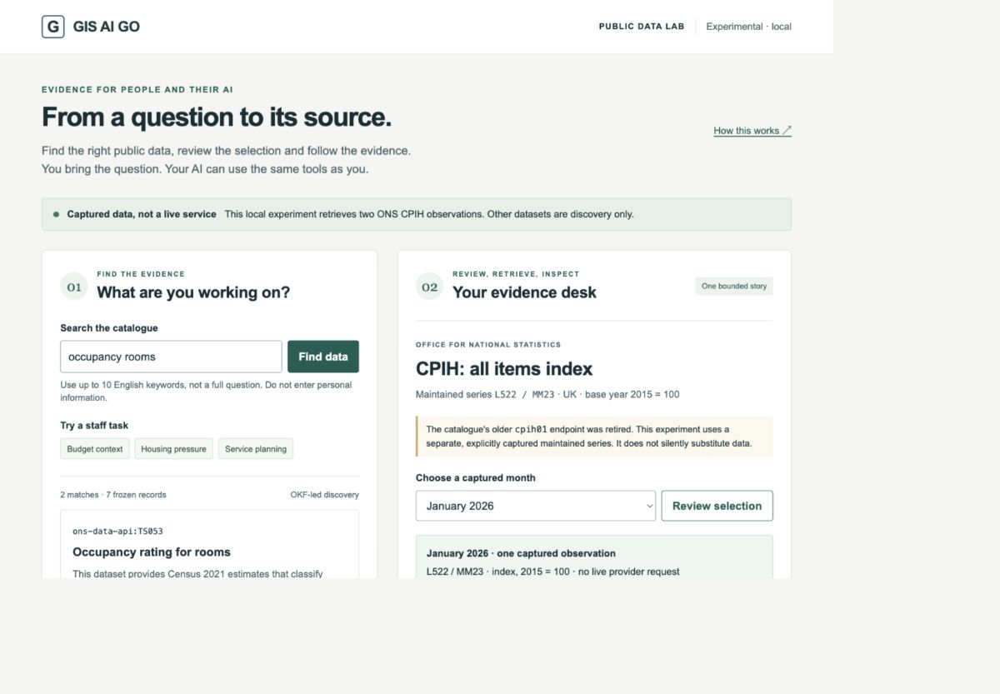
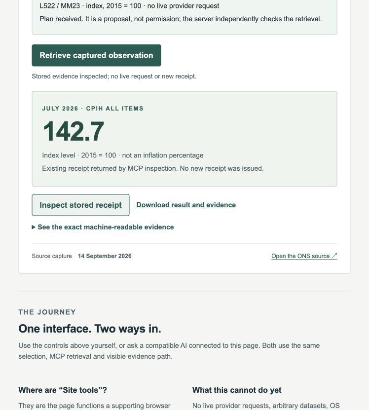

# WEB-216: run the local public-data workbench

Observed on 14 September 2026. This is an experimental local extension, not a
live ONS service, the hosted Site, or the supported `v0.2.0` release. The original
two-tool `/demo`, Pages product and five-tool local candidate are unchanged.

## What this demonstrates

A person or a compatible AI can discover relevant metadata, review a closed
selection, make a real MCP call and inspect a durable evidence receipt. The AI
is supplied by the visitor's host, not embedded in the website. Data values are
returned by the server; the page does not generate or infer them.

```text
Person using controls ─┐
                      ├─ Same page actions ─ MCP ─ Closed policy and capture
AI using page tools ──┘                       │                 │
                                              └─ Stored receipt ┘
                                                      │
                                         Visible result and inspection
```

Discovery metadata is not execution permission. Only two explicitly admitted
CPIH months can execute. Housing and service-planning stories find metadata but
do not yet retrieve those datasets.

## 1. Start from the repository

Use the repository's pinned Node, pnpm and Python/uv environment. From a clone:

```sh
pnpm install --frozen-lockfile
uv sync --locked --group dev --cache-dir .uv-cache
pnpm start:public-data-workbench
```

Open **http://127.0.0.1:8788/** on the same computer. Leave the terminal running.
Stop with Ctrl+C. The MCP endpoint is **http://127.0.0.1:8788/mcp**. Use these exact
addresses: `localhost`, a LAN address and a hosted page are not interchangeable.
No new provider, model or API key is needed. Installation may contact package
registries; observation retrieval has no provider egress.

The launcher retains owner-only evidence below `.gis-ai-go` in your home directory.
Do not remove it if you need old receipts. Corrupt or substituted state fails
closed; there is no automatic deletion or repair. A second server on the same
port fails rather than choosing another address. Lifecycle HEAD and static hashes
are recorded but are explicitly not clean-build attestations.

## 2. Find suitable data

Choose **Budget context** or enter `consumer prices` in **Search the catalogue**.
Use up to ten English keywords, not an unrestricted natural-language prompt.
Seven frozen metadata records underpin the development example.

Read the warning on `cpih01`: that older endpoint was retired. The maintained
`L522 / MM23` series is a separate, explicitly captured source. Choosing
**Review maintained-series capture** moves focus to the evidence desk; it does
not rewrite the old catalogue or retrieve a value.

**Housing pressure** and **Service planning** illustrate the reconciled staff
stories. Their matches are labelled discovery-only. Curated OKF concepts explain
authored relationships, not a validated general semantic-ranking model.



*Actual viewport capture. It shows the housing search and January selection from
the manual test, not a claim that housing data was retrieved.*

## 3. Review before retrieving

In **Choose a captured month**, select **July 2026**, then **Review selection**.
This makes a real MCP selection call. The page displays the period, native series,
unit and no-live-request boundary. The plan is a proposal, not permission.

Changing the month invalidates the staged selection and disables retrieval until
reviewed again. A delayed response cannot restore a superseded selection.
January and July are the only admitted months; other selections are rejected.

## 4. Retrieve and read the result

Choose **Retrieve captured observation**. The server checks the capture,
selection, policy, request identity and evidence capacity before returning success.

| Month | Returned value | Meaning |
| --- | --- | --- |
| January 2026 | `139.4` | CPIH all-items index, 2015 = 100. |
| July 2026 | `142.7` | CPIH all-items index, 2015 = 100. |

These are **index levels, not inflation percentages**. They came from the admitted
14 September 2026 ONS capture. Starting the application does not refresh them.
No empty success or invented value is shown when retrieval fails.

## 5. Inspect and retain the evidence

Choose **Inspect stored receipt**. This makes another MCP call and returns the
existing linked result, without a new receipt or live provider request. Open
**See the exact machine-readable evidence** for source and transformation detail,
or **Download result and evidence** to retain the returned JSON.



Keep the receipt ID for later inspection. The server retains the record; closing
the page loses its ephemeral request key, not durable evidence. Within a page
session, retrying a plan reuses that key. Cancellation or a lost response does not
prove that persistence did not happen. After a graceful server restart, page-tool
inspection returned the same stored result under exact JSON serialisation.

## 6. Let your own compatible AI use the page

“Site tools” means the functions a supporting browser exposes to its connected
AI, not a button supplied by this website. In Codex, ask to open the exact local
URL in its browser panel, then ask for the page's tools. This observation used
Codex's in-app browser; it does **not** establish identical behaviour in every
ChatGPT browser, ChatGPT Work, Gemini or Copilot.

Ask a compatible host:

> Use this page's tools to find consumer prices, review July 2026, retrieve the
> captured CPIH observation and inspect its stored receipt. Use only returned
> evidence. Explain the index unit and capture date; do not call it live data.

The host must actually expose these four tools:

| Page tool | Effect |
| --- | --- |
| `workbench_find_data` | Find frozen metadata and update visible matches. |
| `workbench_review_cpih_selection` | Stage a server-authored, non-authorising plan. |
| `workbench_retrieve_cpih_and_store_receipt` | Retrieve admitted data and persist evidence through MCP. |
| `workbench_inspect_receipt` | Display the existing stored result. |

All four conservatively declare `readOnlyHint: false` because they change page
state; only retrieval writes durable server state. Hints do not grant authority.
The server separately exposes three closed MCP tools, not the candidate's five.

## Observed compatibility

| Surface tested | Manual path | Page registration | Actual AI-host tool calls |
| --- | --- | --- | --- |
| Codex in-app browser | January `139.4`; July inspection | Four tools | All four succeeded; July `142.7`; same receipt inspected after restart. |
| Chrome `153.0.8010.36`, macOS arm64, ChatGPT extension | July `142.7` retrieved | Four tools reported | Not exposed by the tested connection; the owner's separate extension session reported the same limitation. |
| Edge `153.0.4234.32`, macOS arm64 | July `142.7` retrieved and inspected | Four tools reported | Not exposed by this browser connection; Copilot not tested. |
| Gemini sidebar in Chrome, owner observation | Not independently retested through Gemini | Sidebar acknowledged the page's four-tool status | Reported no access to tool definitions or execution; no successful tool call observed. |

Versions were read from installed applications, not checked for newer updates.
Registration may depend on the connected environment; it is not proof of a native
browser standard implementation. No flags, profile identity, authentication or
security settings were changed. Unsupported hosts retain the manual controls.

The owner reproduced the distinction using the same local URL in a separate
Chrome tab. Duplicating a tab resolved an automation-ownership conflict, but the
ChatGPT extension still reported only page assets and developer-protocol access,
not a callable WebMCP connection. These are separate prerequisites. A subsequent
Edge recheck likewise exposed only `pageAssets` and `cdp`; manual selection still
worked. Neither browser access nor an AI reading the page's registration message
demonstrates a WebMCP call. The Gemini row is a screenshot-backed owner report,
not a vendor-wide implementation claim or an independently executed tool test.

## Assurance and remaining limits

The record separates controller mocks, real loopback calls and real page tools.
Four invalid page-tool inputs were rejected: an overlong term list, unsupported
month, unissued plan and missing receipt. Regressions cover superseded selections,
foreign period/receipt responses, inherited search properties, corruption,
duplicate requests, capacity and body cancellation.

Reflow checks observed no horizontal document overflow at effective CSS widths
325 and 1,200 pixels. These are limited visual checks, not full accessibility
certification or usability research. A full-page screenshot had stitching
artefacts and was excluded; the illustrations above are unedited viewport captures.
Canonical CI includes typechecking, unit tests and the new production build.
Exact-main acceptance is separately recorded in the [journal](../chronicle/WEB-216_JOURNAL.md).

Still outside this slice: live refresh, general statistics, OS mapping and spatial
joins, enterprise identity, hosted persistence, general AI analysis and supported
release acceptance. See [OS/ONS source observations](WEB-216_OS_ONS_SOURCE_OBSERVATIONS.md)
and the [delivery programme](WEB-216_PUBLIC_DATA_WORKBENCH.md).
